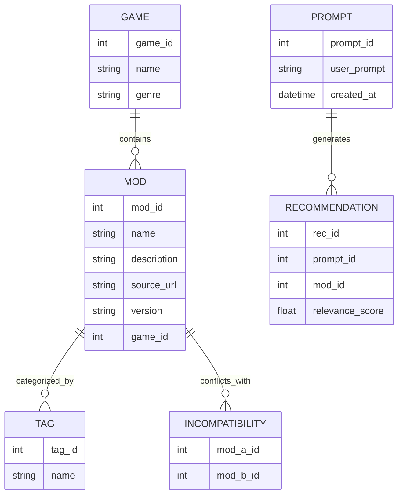

# ModMuse 🎮
**AI-Powered Mod Recommendation Generator**

---

## Project Summary

**ModMuse** is an AI-powered recommendation system that helps gamers discover new ways to enjoy their favorite titles.  
By entering a natural-language prompt such as _“I want a hardcore survival experience in Skyrim”_, ModMuse intelligently generates a curated list of compatible mods that deliver that experience.

The system uses AI to:
- Parse the player’s intent
- Match it with mod metadata (genre, theme, mechanics, compatibility)
- Filter and rank mods for the best combined experience

Ultimately, ModMuse aims to support multiple games and allow community-driven updates to mod data.

---

## Purpose and Goals

**Purpose:** Streamline the process of finding compatible and theme-consistent mods using natural language.

**Goals:**
- Parse user intent with AI (e.g., GPT or similar model)
- Query a mod metadata database (tags, categories, dependencies)
- Filter out incompatible or redundant mods
- Provide a formatted recommendation list with relevance scores and compatibility indicators
- (Optional) Visualize mod compatibility networks

---

## Entity-Relationship Diagram (ERD)



## System Design Overview

```mermaid
graph TD

    %% --- Frontend Layer ---
    subgraph Frontend
        A[React / Vue App<br>• Prompt Input<br>• Mod Display UI]
    end

    %% --- Backend Layer ---
    subgraph Backend
        B[API Server FastAPI / Node.js<br>• Handles requests<br>• Validates input<br>• Calls AI & DB]
        C[AI Prompt Processor<br>• Analyzes user intent<br>• Generates mod keywords]
        D[Database<br>Postgres / MySQL<br>• Stores mods, tags, compatibility]
    end

    %% --- Data Flow ---
    A -->|Submit Prompt| B
    B -->|Send Prompt →| C
    C -->|Return Mod Keywords| B
    B -->|Query Mods| D
    D -->|Return Mod Data| B
    B -->|Return JSON Response| A

    %% --- Optional Layers ---
    subgraph Optional_Components [Optional Components]
        E[(Vector DB / Semantic Search)]
    end
    C -.->|Embed Search| E
    E -.->|Relevant Mods| B

