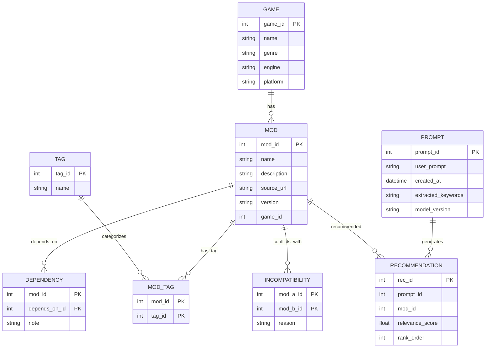
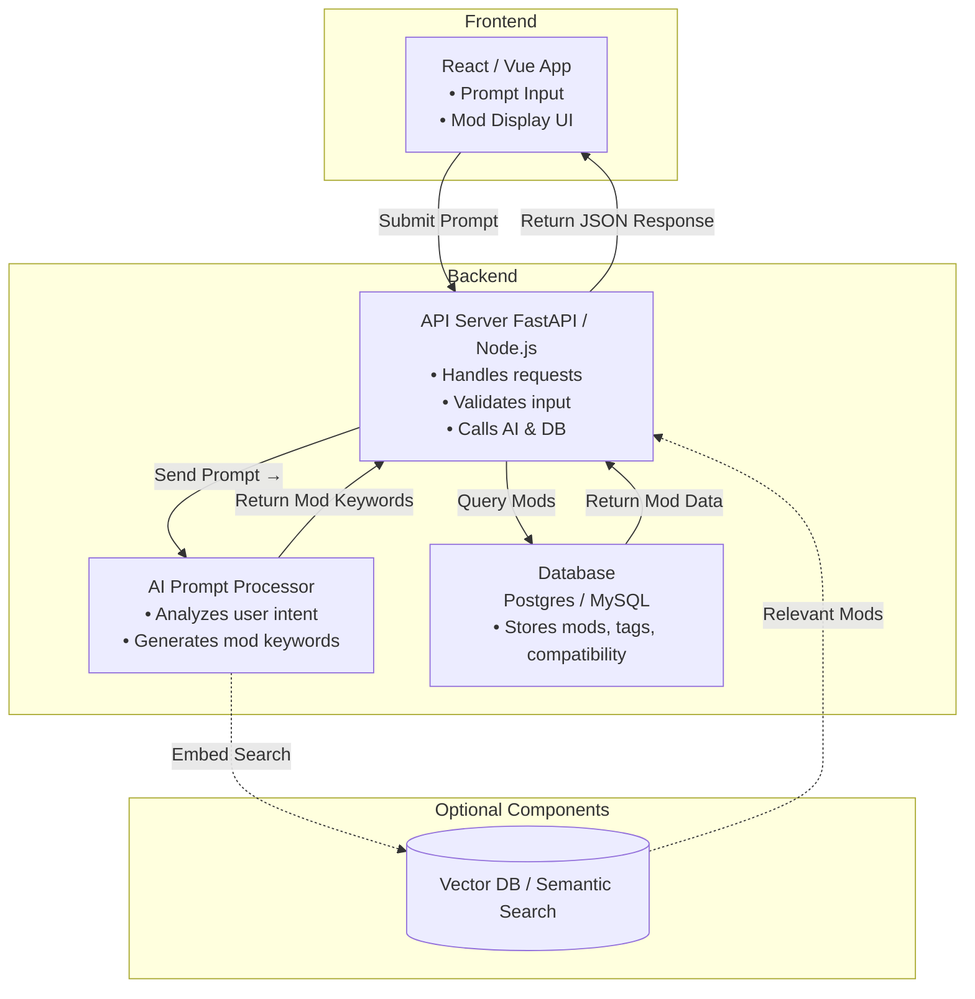

# ModMuse 🎮
**AI-Powered Mod Recommendation Generator**

---

## Project Summary

**ModMuse** is an AI-powered recommendation system that helps gamers discover new ways to enjoy their favorite titles.  
By entering a natural-language prompt such as _“I want a hardcore survival experience in Skyrim”_, ModMuse intelligently generates a curated list of compatible mods that deliver that experience.

The system uses AI to:
- Parse the player’s intent
- Match it with mod metadata (genre, theme, mechanics, compatibility)
- Filter and rank mods for the best combined experience

Ultimately, ModMuse aims to support multiple games and allow community-driven updates to mod data.

---

## Purpose and Goals

**Purpose:** Streamline the process of finding compatible and theme-consistent mods using natural language.

**Goals:**
- Parse user intent with AI (e.g., GPT or similar model)
- Query a mod metadata database (tags, categories, dependencies)
- Filter out incompatible or redundant mods
- Provide a formatted recommendation list with relevance scores and compatibility indicators
- (Optional) Visualize mod compatibility networks

---

## Estimated Timeline

| Date            | Goal                                                                        |
| --------------- | --------------------------------------------------------------------------- |
| **Part 1**  | Create GitHub repository, upload `README.md`, `design.md`                   |
| **Part 2**  | Set up backend skeleton (FastAPI or Node.js)                                |
| **Part 3**  | Build and seed initial mod/game database                                    |
| **Part 4**  | Integrate AI model (OpenAI API or local LLM)                                |
| **Part 5**  | Connect backend and frontend for prompt submission                          |
| **Part 6**  | Implement filtering and compatibility logic                                 |
| **Part 7**  | Polish UI, add styling, prepare demo and presentation                       |

---

## Entity-Relationship Diagram (ERD)

## System Design Overview

## Slides
https://docs.google.com/presentation/d/1JrcAZBN7xFJBF8rkntW1gxgdiFdbBMdovn92lKjQpHc/edit?usp=sharing

## Things I've learned while working on this
1. How to design and implement a complete AI-assisted recommendation pipeline.
2. How to integrate pgvector with SQLAlchemy and handle embeddings correctly.
3. How to structure domain models, async queries, and data loading for efficient retrieval.

## Why This Project Interests Me
I’ve always enjoyed exploring modded game experiences, but the process of finding compatible mods is slow and frustrating. Building ModMuse let me merge two passions—gaming and AI—to create a system that genuinely solves a real-world pain point for players. It also gave me hands-on experience with real semantic retrieval systems.

## Key Learnings
1. Hybrid AI systems outperform single-method systems — embeddings + tags worked best.
2. Type handling matters — pgvector, asyncpg, and SQLAlchemy all expect different formats.
3. Good relational modeling makes everything easier — clean Mod/Tag/Prompt relationships simplified ranking and filtering.
4. Scalability improves with async + proper query optimization.
5. AI tools massively speed up development—but require careful validation.

## Failover, Scaling, and Performance Characteristics
**Failover**:
- If embedding search fails or returns nothing, ModMuse automatically falls back to keyword/tag-based filtering.

**Scaling**
- Backend is stateless → easily horizontally scaled.
- Vector searches remain fast due to pgvector indexing.
- Async IO allows high concurrency.

**Performance**
- Vector <=> similarity is efficient even at scale.
- Relationship loading optimized with selectinload.
- LLM calls happen only once per prompt.

**Authentication**
- Local development uses no auth, but JWT or OAuth can be added without structural changes.

**Concurrency**
- Async SQLAlchemy sessions allow many simultaneous client requests.
- Long-running AI calls do not block the event loop.
